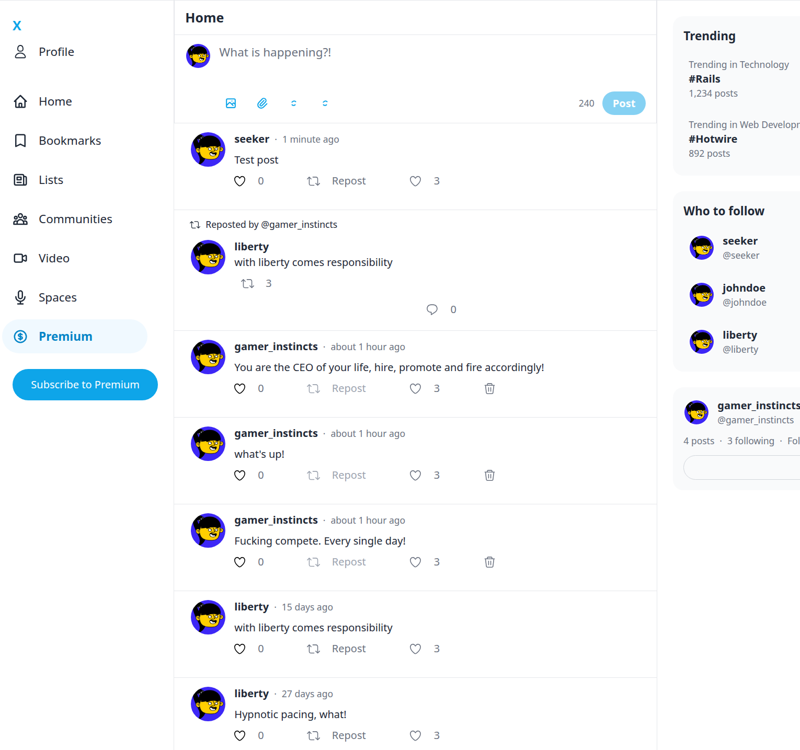
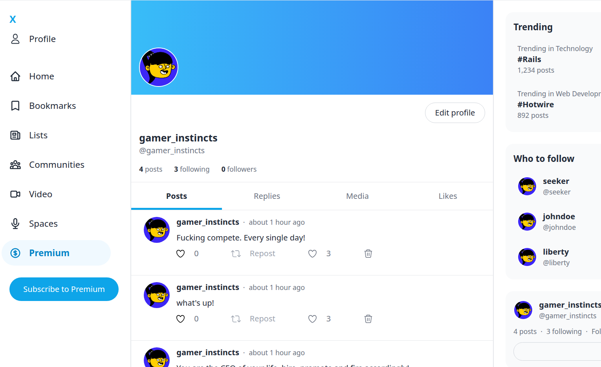

# X - A Twitter/X Clone

A modern social media application built with Ruby on Rails 8, featuring real-time updates with Hotwire (Turbo & Stimulus). Built to replicate the X/Twitter experience with a focus on performance and user experience.




##  Features

### Core Functionality
- **User Authentication** - Sign up, sign in, and manage sessions with Devise
- **Posts & Tweets** - Create, view, and delete posts with 240 character limit
- **Real-time Updates** - Turbo Streams for instant UI updates without page reloads
- **Interactive Likes** - Like/unlike posts with live count updates
- **Reposts** - Share content from other users with one click
- **Comments** - Reply to posts with real-time updates

### Enhanced Features
- **Profile Management** - Upload and change profile pictures with validation
- **Character Counter** - Real-time character counting with visual warnings
- **Sticky Post Form** - Persistent compose area with expand/collapse functionality
- **Rich Sidebar** - Navigation with Premium, Video, Communities, Bookmarks, Lists, Spaces
- **Trending Topics** - Dynamic trending content display
- **Who to Follow** - User discovery and suggestions
- **Responsive Design** - Mobile-first approach with Tailwind CSS

## 🛠 Tech Stack

### Backend
- **Framework**: Ruby on Rails 8.0
- **Database**: PostgreSQL with foreign key constraints
- **Authentication**: Devise with custom registrations controller
- **File Storage**: Active Storage with image validation
- **Background Jobs**: Solid Queue
- **Caching**: Solid Cache
- **Real-time**: Turbo Streams & Solid Cable

### Frontend
- **JavaScript**: Hotwire (Turbo + Stimulus) for SPA-like experience
- **Styling**: Tailwind CSS v3 with custom components
- **Asset Pipeline**: Propshaft + jsbundling-rails (esbuild)
- **Icons**: Heroicons SVG components
- **Interactivity**: Custom Stimulus controllers

### Development & Deployment
- **Testing**: Minitest with integration and model tests
- **Code Quality**: RuboCop Rails Omakase
- **Security**: Brakeman scanning
- **Deployment**: Kamal (Docker-based)
- **Process Management**: Puma web server

## Requirements

- Ruby 3.2+
- PostgreSQL
- Node.js & Yarn

## Getting Started

### 1. Clone the repository

```bash
git clone git@github.com:samuel-sarmah/X.git
cd X
```

### 2. Install dependencies

```bash
bundle install
yarn install
```

### 3. Setup the database

```bash
bin/rails db:create
bin/rails db:migrate
bin/rails db:seed  # Optional: load seed data
```

### 4. Start the development server

```bash
bin/dev
```

This starts the Rails server, CSS watcher, and JS bundler concurrently.

Visit `http://localhost:3000` in your browser.

## Running Tests

```bash
bin/rails test
```

## Project Structure

```
app/
├── controllers/
│   ├── posts_controller.rb      # Posts CRUD
│   ├── comments_controller.rb   # Comments on posts
│   └── profiles_controller.rb   # User profiles
├── models/
│   ├── user.rb                  # User model (Devise)
│   ├── post.rb                  # Post model (supports reposts)
│   └── comment.rb               # Comment model
└── views/
    ├── posts/                   # Post views and partials
    ├── comments/                # Comment partials and Turbo Streams
    └── profiles/                # Profile views
```

## 🚀 Recent Updates (v0.0.1)

### New Features Added
- **✅ Like System**: Full like/unlike functionality with real-time count updates
- **✅ Enhanced Profile Pages**: Cover images, stats, tabs, and follow buttons
- **✅ Improved Post Form**: Sticky compose area with character counter and media buttons
- **✅ Rich Sidebar Navigation**: Premium, Video, Communities, Bookmarks, Lists, Spaces
- **✅ Profile Picture Upload**: Upload and save profile images with validation
- **✅ Better UX**: Hover effects, transitions, and mobile-responsive design
- **✅ Trending & Discovery**: Dynamic trending topics and user suggestions

### Technical Improvements
- Fixed Tailwind CSS compatibility and build issues
- Added proper database constraints and validations
- Implemented comprehensive error handling
- Enhanced accessibility with proper ARIA labels
- Improved performance with optimized database queries

## API Routes

| Method | Path | Description |
|--------|------|-------------|
| GET | `/` | Home feed (all posts) |
| POST | `/posts` | Create a new post |
| GET | `/posts/:id` | View a single post with comments |
| DELETE | `/posts/:id` | Delete a post |
| POST | `/posts/:id/repost` | Repost a post |
| POST | `/posts/:post_id/likes` | Like a post |
| DELETE | `/posts/:post_id/likes/:id` | Unlike a post |
| POST | `/posts/:post_id/comments` | Add a comment |
| DELETE | `/posts/:post_id/comments/:id` | Delete a comment |
| GET | `/profiles/:id` | View a user profile |

## Deployment

This app is configured for deployment with [Kamal](https://kamal-deploy.org/). See `config/deploy.yml` for configuration.

```bash
bin/kamal setup
bin/kamal deploy
```

## License

This project is open source and available under the [MIT License](LICENSE).
